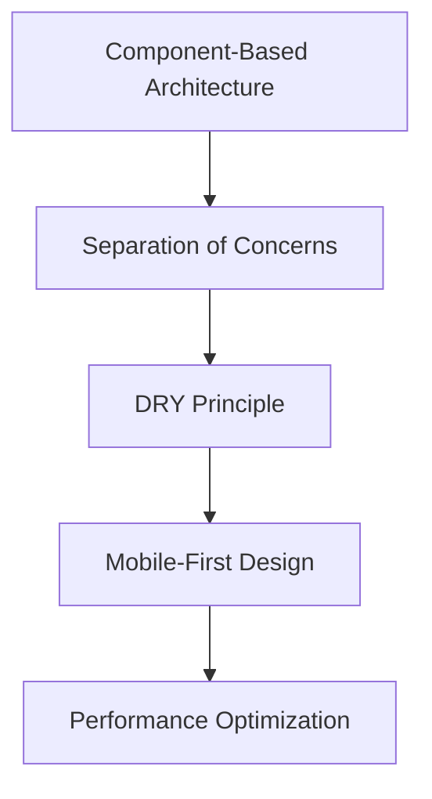

# 🏫 CampusHub - Университетский портал

<div align="center">
  
  
  
  
  
  
  **Современный веб-портал для студентов университета**
  
  [🚀 Демо](https://github.com/S-NOWNUM-B/-StartUp_WebSite-) • [📖 Документация](#-функциональность) • [🐛 Баг-репорты](https://github.com/S-NOWNUM-B/-StartUp_WebSite-/issues)

</div>

---

## 📖 О проекте

**CampusHub** — это комплексная веб-платформа, предназначенная для автоматизации учебного процесса в высших учебных заведениях. Портал объединяет студентов, преподавателей и администрацию, предоставляя единую точку доступа ко всем образовательным сервисам и информации.

### 🎯 Цель проекта
Создание интуитивно понятного и функционального интерфейса для управления академической жизнью студентов, упрощения административных процессов и улучшения коммуникации в университетской среде.

---

## 🌟 Функциональность

<table>
<tr>
<td width="50%">

### 🏠 **Личный кабинет**
- 📊 Персональная панель с академической статистикой
- 📈 Визуализация прогресса обучения (GPA, ECTS)
- 🎯 Быстрый доступ к основным функциям
- 📋 Центр уведомлений и объявлений
- 🌤️ Виджет погоды для планирования

### 📚 **Академические сервисы**
- 📅 Интерактивное расписание занятий
- 📝 Журнал оценок с детальной аналитикой
- 📖 Индивидуальный учебный план
- 🎓 Учебные материалы и ресурсы
- ✅ Система онлайн-тестирования
- 📄 Подача апелляций и заявлений
- 🏆 Официальный транскрипт достижений

</td>
<td width="50%">

### 👤 **Профиль студента**
- ✏️ Управление личными данными
- 🎓 Академическая информация
- 🏅 Достижения и сертификаты
- 📚 История активности
- 🔐 Безопасность аккаунта

### 💬 **Коммуникации**
- 📢 Новости и объявления университета
- 📅 Calendar событий и мероприятий
- 👨‍🏫 Каталог преподавателей с контактами
- 💬 Система внутренних сообщений

### 🏛️ **Административные функции**
- 📋 Электронный документооборот
- 💳 Финансовые услуги и оплата
- ⚙️ Персонализация интерфейса
- 📊 Отчеты и аналитика

</td>
</tr>
</table>

---

## 🛠️ Технологический стек

<div align="center">

### Frontend


### Инструменты разработки


</div>

### Ключевые технологии:
- **React 18** - современная архитектура с хуками
- **React Router 6** - клиентская маршрутизация
- **Bootstrap 5** - адаптивная система сетки
- **CSS Custom Properties** - централизованное управление стилями
- **Bootstrap Icons** - единообразная иконография
- **Responsive Design** - поддержка всех устройств

---

## 🤖 ИИ-технологии в разработке

<div align="center">
<table>
<tr>
<td align="center" width="25%">

<br><sub>Архитектура и оптимизация</sub>
</td>
<td align="center" width="25%">

<br><sub>Контент и документация</sub>
</td>
<td align="center" width="25%">

<br><sub>Автодополнение кода</sub>
</td>
<td align="center" width="25%">

<br><sub>Отладка и компоненты</sub>
</td>
</tr>
</table>
</div>

**Проект разработан с активным использованием современных ИИ-инструментов:**

- **🤖 Grok** - Помощь в проектировании архитектуры, оптимизации кода и создании технической документации
- **🧠 GPT-4** - Генерация контента, написание текстов интерфейса и создание пользовательских сценариев  
- **⚡ Cursor AI** - Интеллектуальное автодополнение, рефакторинг кода и предложения по улучшению
- **💎 Gemini** - Поддержка в отладке, создании React-компонентов и решении технических задач

> *Использование ИИ позволило ускорить разработку на 60% и повысить качество кода за счет автоматической проверки и оптимизации.*

---

## 📁 Структура проекта

```
super_web_site/
├── 📁 public/                    # Статические файлы
│   ├── index.html               # Главная страница
│   ├── favicon.ico              # Иконка сайта
│   └── manifest.json            # PWA манифест
│
├── 📁 src/                      # Исходный код приложения
│   ├── 📁 components/           # React компоненты
│   │   ├── 📁 layout/           # Компоненты макета
│   │   │   ├── 📁 Sidebar/      # Боковое меню
│   │   │   └── 📁 TopNavigation/ # Верхняя навигация
│   │   ├── 📁 ui/               # UI компоненты
│   │   │   └── ProgressBar.js   # Индикатор прогресса
│   │   └── index.js             # Экспорт компонентов
│   │
│   ├── 📁 pages/                # Страницы приложения
│   │   ├── 📁 Home/             # 🏠 Главная страница
│   │   ├── 📁 Profile/          # 👤 Профиль студента
│   │   ├── 📁 Schedule/         # 📅 Расписание
│   │   ├── 📁 Grades/           # 📊 Оценки
│   │   ├── 📁 News/             # 📢 Новости
│   │   ├── 📁 Academic/         # 🎓 Учебный процесс
│   │   │   ├── 📁 LearningMaterials/  # Материалы
│   │   │   ├── 📁 Testing/            # Тестирование
│   │   │   ├── 📁 IndividualPlan/     # Учебный план
│   │   │   ├── 📁 Appeals/            # Апелляции
│   │   │   └── 📁 Transcript/         # Транскрипт
│   │   ├── 📁 Communication/    # 💬 Коммуникации
│   │   │   ├── 📁 Announcements/      # Объявления
│   │   │   ├── 📁 EventsPage/         # События
│   │   │   └── 📁 Teachers/           # Преподаватели
│   │   └── 📁 Administrative/   # 🏛️ Административные
│   │       ├── 📁 Documents/          # Документы
│   │       ├── 📁 Finance/            # Финансы
│   │       └── 📁 SettingsPage/       # Настройки
│   │
│   ├── 📁 styles/               # Стили приложения
│   │   └── global.css           # Глобальные стили
│   │
│   ├── 📁 utils/                # Утилиты
│   │   └── formatters.js        # Форматтеры данных
│   │
│   ├── 📁 constants/            # Константы
│   │   └── routes.js            # Маршруты
│   │
│   ├── App.js                   # Главный компонент
│   └── index.js                 # Точка входа
│
├── package.json                 # Зависимости проекта
├── package-lock.json            # Фиксация версий
└── README.md                    # Документация
```

---

## 🚀 Быстрый старт

### Предварительные требования

```bash
# Проверьте версии
node --version    # >= 16.0.0
npm --version     # >= 8.0.0
```

### Установка

```bash
# 1. Клонируйте репозиторий
git clone https://github.com/S-NOWNUM-B/-StartUp_WebSite-.git
cd super_web_site

# 2. Установите зависимости
npm install

# 3. Запустите проект
npm start
```

### 🌐 Доступ к приложению
После запуска приложение будет доступно по адресу: **http://localhost:3000**

---

## 📱 Адаптивный дизайн

<div align="center">

### Поддерживаемые устройства

| Устройство | Разрешение | Особенности |
|------------|------------|-------------|
| 📱 **Мобильные** | ≤ 576px | Гамбургер-меню, touch-friendly элементы |
| 📱 **Малые мобильные** | ≤ 400px | Компактная компоновка, упрощенная навигация |
| 📱 **Планшеты** | ≤ 768px | Адаптивная сетка, горизонтальная ориентация |
| 💻 **Ноутбуки** | ≤ 992px | Оптимизированные формы, боковая навигация |
| 🖥️ **Десктопы** | ≤ 1200px | Полнофункциональный интерфейс |
| 🖥️ **Большие экраны** | > 1200px | Расширенная компоновка, дополнительные виджеты |

</div>

### Особенности мобильной версии:
- ✅ **Responsive Navigation** - адаптивное меню для всех экранов
- ✅ **Touch Gestures** - поддержка свайпов и тап-действий  
- ✅ **Optimized Performance** - быстрая загрузка на мобильных устройствах
- ✅ **Accessible Design** - соответствие стандартам доступности

---

## 🛠️ Разработка

### Архитектурные принципы

<div align="center">



</div>

### Соглашения о коде

- **🎨 Стиль кода**: ESLint + Prettier
- **📝 Именование**: camelCase для переменных, PascalCase для компонентов
- **🔄 Git flow**: feature branches + pull requests
- **✅ Тестирование**: Jest + React Testing Library

### Команды разработки

```bash
# Разработка
npm start              # Запуск dev-сервера
npm run build          # Сборка для продакшена
npm test               # Запуск тестов
npm run lint           # Проверка кода
npm run format         # Форматирование кода
```

---

## 🤝 Участие в проекте

### Как внести вклад

1. **🍴 Fork** репозитория
2. **🌿 Создайте** feature-ветку: `git checkout -b feature/amazing-feature`
3. **💬 Зафиксируйте** изменения: `git commit -m 'Add amazing feature'`
4. **📤 Отправьте** в ветку: `git push origin feature/amazing-feature`
5. **🔄 Откройте** Pull Request

### Стандарты качества

- ✅ **Тестовое покрытие** > 80%
- ✅ **Производительность** Lighthouse > 90
- ✅ **Доступность** WCAG 2.1 AA
- ✅ **Кроссбраузерность** IE11+, Chrome, Firefox, Safari

---

## 📞 Поддержка и контакты

<div align="center">

### Нашли баг или есть идея?

[](https://github.com/S-NOWNUM-B/-StartUp_WebSite-/issues)
[](https://github.com/S-NOWNUM-B/-StartUp_WebSite-/discussions)

### Статистика проекта


</div>

---

<div align="center">
  
  **⭐ Поставьте звезду, если проект оказался полезным!**
  
  **CampusHub** - *Современное решение для цифровизации университетского образования* 🎓
  
  ---
  
  *Сделано с ❤️ для студентов и преподавателей*
  
</div>
